
\

# P3-Timer-JDA

A [Discord](https://discord.com/) bot to watch for pings. Disables mentioning a role for an amount of time if it has
been mentioned by a user without the `Mention @everyone, @here, annd All Roles` permission.

# How to Set Up

First you'll need a Discord token. Then decide how you'll run the bot.

### Obtain a Discord Bot Token

1. Head to the [Discord Developer Panel](https://discord.com/developers/applications) and create a new application.
2. Go to the `Bot` panel on the right.
3. Under `Token`, click `Reset Token` button.
4. Confirm by clicking `Yes, do it!` Authenticate if necessary.
5. Click `Copy` to copy the token. ***DO NOT SHARE THIS TOKEN WITH ANYONE. NEITHER I NOR A DISCORD EMPLOYEE WILL
   ASK FOR IT.***
6. Save this somewhere safe for now.
7. Head to `Installation`
8. Uncheck `User install`
9. Under `Install Link`, select `None`.\
   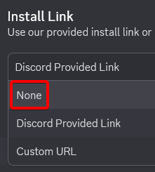
10. Click `Save Changes`
11. Head back to the `Bot` panel
12. Toggle off `Public Bot` to prevent others from adding the bot.
13. Toggle on `Message Content Intent`. **If you do not toggle this on, the bot will not function.**\
    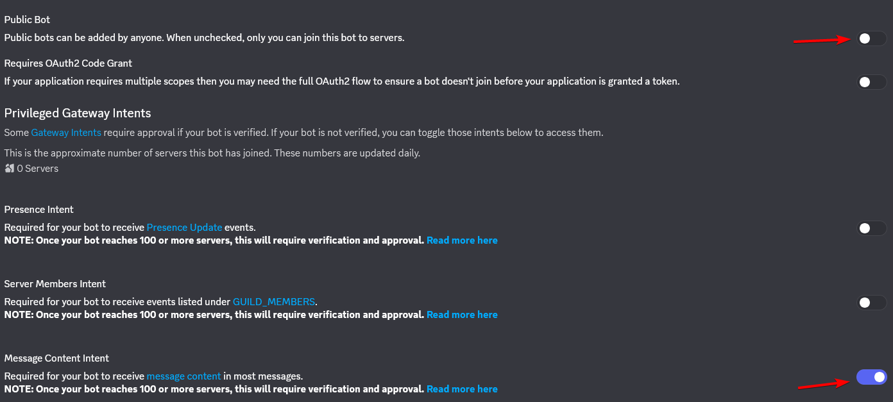

### With AMP (preferred)

With [AMP](https://cubecoders.com/AMP) or Application Management Panel by CubeCoders you'll be able to run the bot as
well as
easily update the bot and restart it very easily. It is one-time payment for a lifetime license for $10 USD
for the Starter Edition for 5 instances. You can also use this to run Minecraft or any Steam servers.

1. Head to [AMP Install page](https://cubecoders.com/AMP/Install) and download the correct version for your OS/server.
2. Complete the installation set up (HTTPS not required; Docker container recommended).
3. In the `Instances` page, click `Create Instance`.
   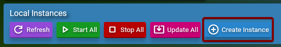
4. Under the `Select Application` dropdown, choose `Java App Runner`.
   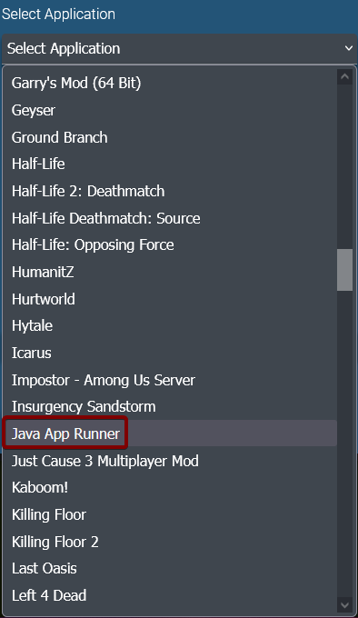
5. Under `After Creation`, select `Do Nothing`.\
   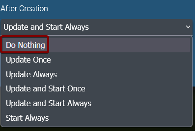
6. Set a name for the instance (if desired) and click `Create Instance`.
7. Click the green cube icon.\
   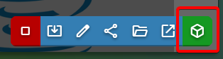
8. Head to `Configuration` > `Java App Runner`
9. Under `Java Version`, select `Specific instance version`.\
   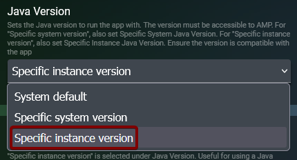
10. Under `Specific Instance Java Version`, select `25 - LTS`.
    
11. Under `Download` tab, in the `App Download Type` dropdown, select `Download URL`
    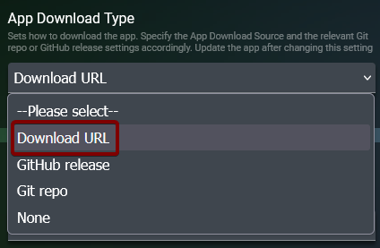
12. Head to [releases](https://github.com/dumbdemon/P3-Timer-JDA/releases) and copy the link to the latest zip file
    of the bot.
13. Paste the link in `App Download Source`.
14. Click `< Back` and head to the `Status` page.
15. Click `Update` to automatically download and unzip the bot files.
16. Head to `File Manager`
17. Right-click `config.yml.example` file and select `Rename` in the dropdown menu.\
    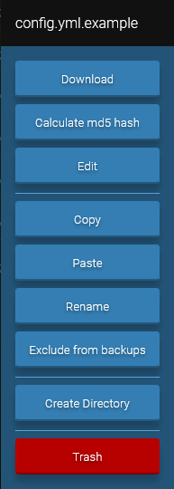
18. Remove the `.example` and click `OK`.\
    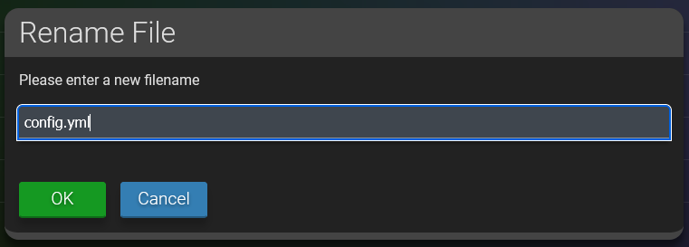
19. Double-click `config.yml` to edit the file.
20. Paste the token into the `token:` section. NOTE: Make sure there is a space between the colon and the token.
21. Change the other settings as you see fit.
22. Click the green `Save` button on the top-right and then `Close`.\
    
23. Copy the name of the jar file.
24. Head back to `Configuration` > `Java App Runner`
25. Paste the file name under `Jar Name`\
    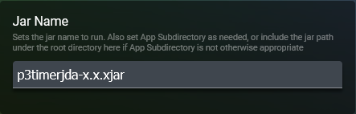
26. Head to `Console` and click green start button.\
    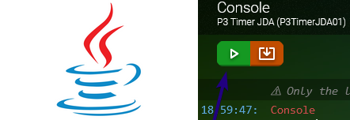

Your bot is now running, and you should be able to invite the bot and run commands without issues.

### Without AMP

1. Head to [releases](https://github.com/dumbdemon/P3-Timer-JDA/releases) and download the latest
   version of the zip file of the bot.
2. Transfer the zip file to the server or VPS hosting the bot.
3. Unzip the zip file into its own folder.
4. Head to [Adoptium](https://adoptium.net/temurin/releases?version=25&os=any&arch=any) and download and install
   Temurin® JDK 25 or newer.
5. Open `config.yml` in your favorite text editor.
6. Paste the token into the `token:` section. NOTE: Make sure there is a space between the colon and the token.
7. Change the other settings as you see fit then save and close the editor.
8. In the terminal, test run the bot by typing `java -jar p3timerjda-<version>.jar` (replace <version> with the
   latest version of the bot). If you see the message, `Login Successful!` then everything is running perfectly.
   If you see anything else or if it doesn't stay open, try resetting the token and try again; otherwise, open an issue
   and let me know what happened.
9. Shut the bot down by hitting `CTRL` + `C`.
10. Create a script to start the bot. Some simple examples:
    1. [Batch Example](https://gist.github.com/dumbdemon/bcc2fed6bae637c680fcf5a9efb2086c)
    2. [Bash Example](https://gist.github.com/dumbdemon/cfbe8551e716d919762edb9b95d6c3ec)
11. Using the script, set the server or VPS to call the script at startup.

### Invite the Bot

Once you have successfully launched the bot at least once, a file name `inviteLink.txt` should appear in the root
folder. In it should contain a link to invite the bot to a server of your choice.